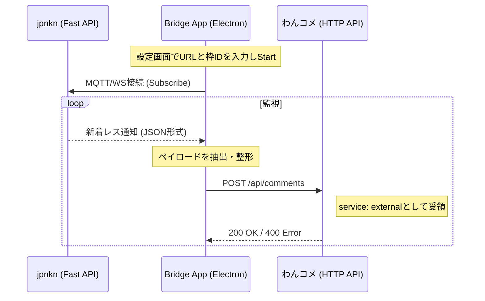

# アーキテクチャと通信フロー

本アプリは、掲示板（jpnkn）の新着レスを検知し、わんコメの外部コメント送信APIへ橋渡しするブリッジとして機能します。

## 通信シーケンス

## 内部コンポーネント
- **Main Process (`main.js`)**: アプリのライフサイクル管理、トレイ常駐、自動起動設定を担当。
- **Renderer Process**: 設定UIの表示と、MQTT/HTTP通信の実装（またはPreload経由の制御）。
- **Config (`config.js`)**: 接続先URLやService IDなどの永続化管理。
